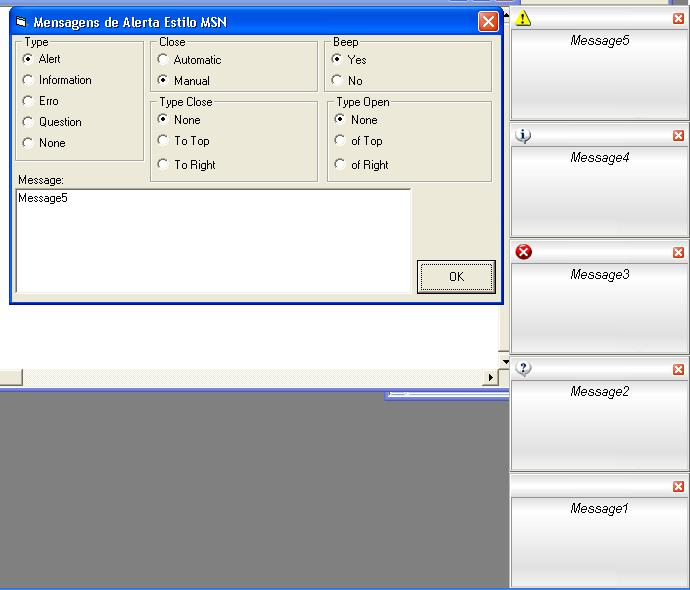



## Alert Messages like MSN

### Description

Its a cool way to you show alerts, informations, or any messages on your program, its very simple and have a good features and inteface.

It's show how much message (With animation) you need, if right side of screen is full, its wait one message close to show a new message.
 
### More Info
 

             |
---                |---
**Submitted On**   |2004-08-27 12:58:58
**By**             |[Fausto Fiorese Branco](https://github.com/Planet-Source-Code/PSCIndex/blob/master/ByAuthor/fausto-fiorese-branco.md)
**Level**          |Intermediate
**User Rating**    |5.0 (15 globes from 3 users)
**Compatibility**  |VB 5\.0, VB 6\.0
**Category**       |[Custom Controls/ Forms/  Menus](https://github.com/Planet-Source-Code/PSCIndex/blob/master/ByCategory/custom-controls-forms-menus__1-4.md)
**World**          |[Visual Basic](https://github.com/Planet-Source-Code/PSCIndex/blob/master/ByWorld/visual-basic.md)
**Archive File**   |[Alert\_Mess18077310192004\.zip](https://github.com/Planet-Source-Code/fausto-fiorese-branco-alert-messages-like-msn__1-56826/archive/master.zip)

